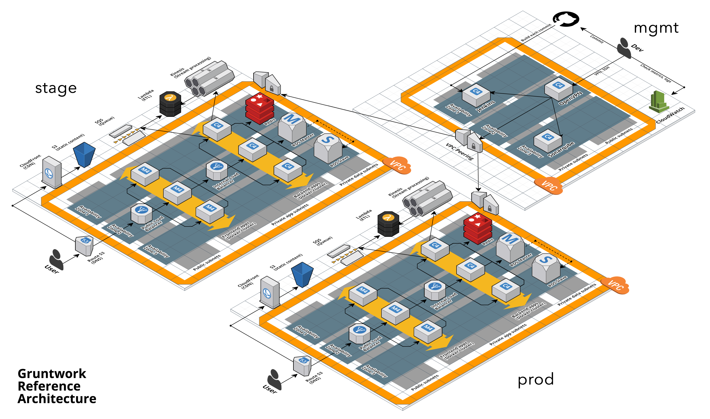
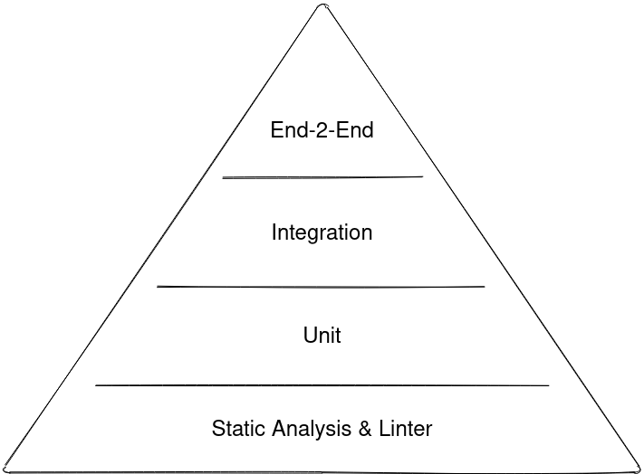
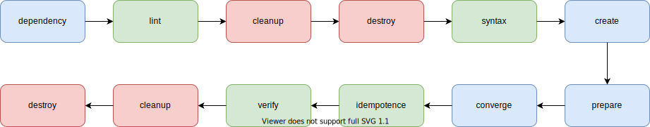

= Veränderung ermöglichen
:revealjs_theme: white
:revealjs_hash: true
:revealjs_history: true
:source-highlighter: highlightjs
:revealjs_width: "90%"
:customcss: custom.css

Testgetriebene Entwicklung mit Ansible und Molecule

== $ whoami

*Felix Peters*

DevOps & Operations Engineer +
E. Breuninger GmbH & Co - Stuttgart

image::https://upload.wikimedia.org/wikipedia/commons/thumb/f/fa/Breuninger-Logo.svg/2000px-Breuninger-Logo.svg.png[width=400px]

https://github.com/FlxPeters[Github/FlxPeters] · https://flxpeters.de[flxpeters.de]

[.boxed]
== Infrastrukture im Cloud-Zeitalter



[role="columns blured"]
=== Infrastrukture im Cloud-Zeitalter


[.column]
--
* 👍 Automatisierbar +
* 👍 Flexibel +
* 👍 As Code
--

[.column]
--
* 👎 Verteilt +
* 👎 Unterschiedlich +
* 👎 *Komplex*
--


[.notes]
--
* Clouds und Container ermöglichen uns Infrastruktur als Code zu schreiben
* Ops kommt deshalb nicht mehr ohne Dev aus. 
* Ansible, Terraform, Puppet, Chef etc. 
--

[.notes]
--
* Komplexe Zusammenhänge
* Unterschiedliche Technologien
* Viele bewegliche Teile mit unbekannten Seiteneffekten

Das führt zu Angst vor Veränderung
--

=== Komplexität

[%step]
* Erhöht die Einstiegshürde in ein Projekt
* Schafft Kopfmonopole und Silowissen
* *Erzeugt Angst vor Veränderung*

=== !

image::https://media3.giphy.com/media/33iqmp5ATXT5m/giphy.gif[canvas]

> "Fear is the path to the dark side. +
 Fear leads to anger. +
 Anger leads to hate. +
 Hate leads to suffering"

=== Komplexität ist der Feind

[.boxed]
=== Divide and conquer

image::https://i.pinimg.com/originals/7d/97/f2/7d97f2f27b6667022cd4ef0daf4de1ac.jpg[canvas,size=contain]


[.notes]
--
* Teile-und-herrsche-Verfahren
* Etabliertes Paradigma in der IT
--

=== Komplexität reduzieren 

durch

Zerlegung:: In kleinere überschaubare Einheiten
Komposition:: Kleinere Einheiten formieren neue Einheiten
Testing:: Einheiten werden isoliert und zusammen getestet

[.notes]
--
* Gelöstes Problem der Softwarentwicklung
* Dev + Ops -> Lernen aus der Softwareentwicklung
--

== Testing

> Code without tests is broken by design.


[.notes]
--
* Standard in der Softwareentwicklung
--

=== Tests

[%step]
* beweisen die Funktion und Korrektheit von Code
* verbessern Code-Qualität und Struktur
* formulieren die Aufgabe und Zweck
* ermöglichen das Verändern von Code
* *Tests geben Sicherheit*

=== Testpyramide



== !

image::img/Ansible_logo.svg.png[height=500px]

=== Ansible

Modulares Open-Source Automatisierungs-Werkzeug +
für Linux, Windows, Cloud und Netzwerk

https://www.ansible.com/[ansible.com]

[%step]
* Deklarativer Infrastruktur Code
* Agentless (SSH, Winrm, Napalm, Docker, etc.)
* Red Hat Produkt (seit 2014)

=== Beispiel - Linux

``` YAML
- name: Setup a Linux user
  hosts: all
  tasks:
    - name: Ensure group "admin" exists
      group:
        name: admin
        state: present

    - name: Add the user 'johnd' with a specific uid and a primary group of 'admin'
      user:
        name: johnd
        comment: John Doe
        uid: 1042
        group: admin

```

=== Beispiel - AWS

``` YAML

- name: Setup a AWS EC2 instance
  hosts: all
  tasks:
    - name: Create a EC2 instance
      ec2_instance:
        name: "public-compute-instance"
        key_name: "prod-ssh-key"
        vpc_subnet_id: subnet-42
        instance_type: c5.large
        security_group: default
        network:
            assign_public_ip: true
        image_id: ami-123456

``` 

=== !

image::https://www.rackspace.com/sites/default/files/article-images/blog_254.jpg[canvas, size=auto]

== !


=== Molecule

Modulares Framework zum Testen von Ansible Rollen und Playbooks

https://molecule.readthedocs.io/[molecule.io]

[%step]
* Basiert auf Ansible 
* Standard *Workflow* zum Testen von Ansible Code
* *Szenarien* (z.B. für verschiedene Konfigurationen)
* *Plattformen* (z.B. Support für mehrere OS-Distros)


[.columns]
=== Molecule - Toolset

[.column]
--
*Driver*

* *Docker*
* Podman
* Delegate
* _Vagrant_
* _Cloud_
--

[.column]
--
*Provisioner*

* *Ansible*
--

[.column]
--
*Verifier*

* Ansible
* *Testinfra*
* _Inspec_
--

[.column]
--
*Linter*

* *Ansiblelint*
* Yamllint
--

=== Ansiblelint

Prüft Ansible code auf Best Practices, Code Style und  +
Verhalten die verbessert werden können


```
$ ansible-lint examples/example.yml

[301] Commands should not change things if nothing needs doing
examples/example.yml:9
Task/Handler: unset variable

[206] Variables should have spaces before and after: {{ var_name }}
examples/example.yml:10
    action: command echo {{thisvariable}} is not set in this playbook

```

https://github.com/ansible/ansible-lint[github.com/ansible/ansible-lint]

=== Testinfra

Python Framework zum Testen von Infrastruktur und Server. +
Nutzt als Basis das Pytest Framework. +
Inspiriert von Serverspec. 

``` Python
def test_nginx_is_installed(host):
    nginx = host.package("nginx")
    assert nginx.is_installed
    assert nginx.version.startswith("1.2")

def test_nginx_running_and_enabled(host):
    nginx = host.service("nginx")
    assert nginx.is_running
    assert nginx.is_enabled
```

https://testinfra.readthedocs.io/en/latest/[testinfra.readthedocs.io]

=== Workflow



[.notes]
--
Install dependencies via Ansible Galaxy
Lint the Ansible role code
Prepare: Start one ore more test instances using a driver and apply prepare steps
Converge: Apply the role via an Ansible playbook
Run the playbook again to ensure idempotence
Verify: Run one or more verifiers
Cleanup
--

== Demo

*Ziel:* Testgetriebene Entwicklung einer Ansible Rolle die:

1. Nginx auf CentOS 7 installiert
2. Eine HTML Seite als Default in Nginx platziert

1. User ausrollt
2. Key zuweist
3 Gruppe zuweis
4. Suoders

== Zusammenfassung

[%step]
* Testen gibt *Sicherheit* und verbessert den Code
* Testen schafft *Verständnis* für die Ziele des Codes
* Sicherheit und Verständnis ermöglichen *Veränderung* 

[%notitle]
== Bonus Slides

https://github.com/gruntwork-io/terratest[Terratest]:: Testgetriebene Entwicklung für Packer, Terraform, Docker
https://kitchen.ci/[Kitchen-CI]:: Testgetriebene Entwicklung für Checf
https://learning.oreilly.com/library/view/the-phoenix-project/9781457191350/[The Phoenix Project]:: A Novel about IT, DevOps, and Helping Your Business Win